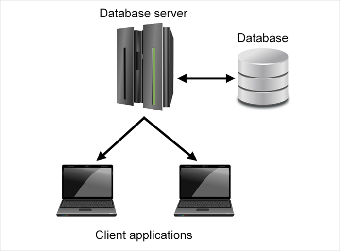

### O programowaniu dla przedszkolaków

Celem tego repozytorium jest stworzenie szkieteletu prezentacji dla namłodszych.
Może zostać wykorzystana w ramach np. przedstawienia zawodu w przedszkolu/szkole podstawowej.

Z racji specyfkiki audytorium poniższy plan zawiera uproszeczenia oraz stawia nacisk na dyskryptywność procesu.

Cel to przedstawić opis pracy jako Web Developer.

# Praca programisty

## Podstawowe zagadnienia programistyczne

### Kominikacja

Klient <=> Server <=> Baza danych

Analogia:

TBD

### Kod => Maszyna

Pokaz robota

Po przez ustawienie fizycznych bloków wzór ruchu robota jest modyfikowany

### Algorytmy

Układanie kostki rubika

Znajomość podstawowych ruchów zawsze daje taki sam efekt końcowy

## Przykład podstawowych narzędzi po stronie klienta

Stworzenie prostej strony z animowanym elementem np. w codepen

## Przykład prostej aplikacji

Aplikacja pozwalająca na:

- Dodanie listy dzieci
- Wybranie funkcji sortującej
- Prosta animacja sortowania

[Przykładowa aplikacja](https://github.com/jzarzeczny/funfunc)

## Przykład bardziej skomplikowanej aplikacji

Aplikacja - gra

[Przykładowa aplikacja](https://github.com/jzarzeczny/kid-learning)
